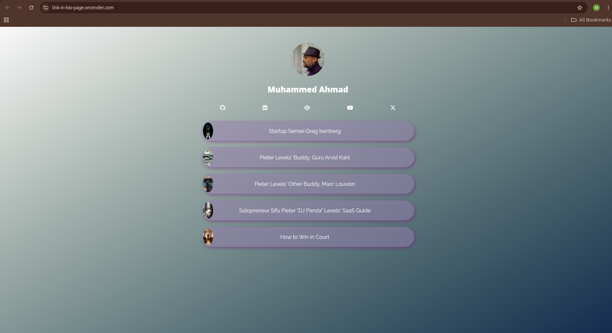

# Link in Bio Page

Link in Bio Page is a personal landing page that collects important social links, creator resources, and external profiles in one simple, visually styled page.

Live Demo: https://link-in-bio-page.onrender.com

## Features

- Personal profile image and name
- Social media icon links
- Large clickable resource buttons
- Gradient background styling
- Card-style link layout
- Responsive static page design

## Tech Stack

- HTML
- CSS
- Render

## Screenshot

## Why I Built This

I built this project to practice creating a polished static landing page with HTML and CSS.

The goal was to build a clean link-in-bio style page that could work as a personal hub for social profiles, creator resources, and useful external links.

## What I Learned

This project helped me practice page layout, spacing, visual hierarchy, link styling, image placement, icons, and responsive frontend design.

## Future Improvements

- Improve mobile spacing
- Add hover animations
- Add more accessibility labels
- Add dark/light theme options
- Update links as my portfolio grows

## Author

Built by Muhammed Ahmad as part of my frontend portfolio.
